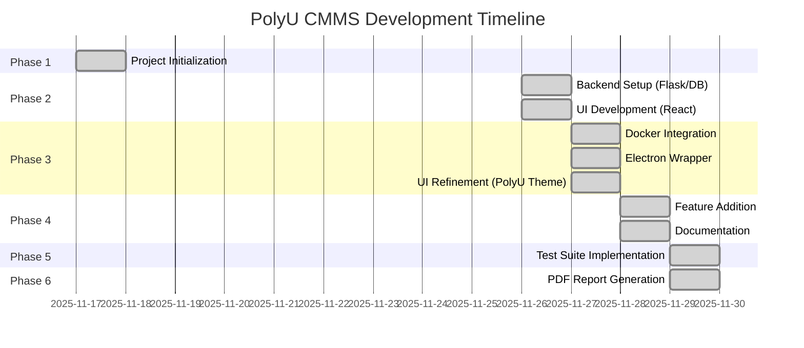
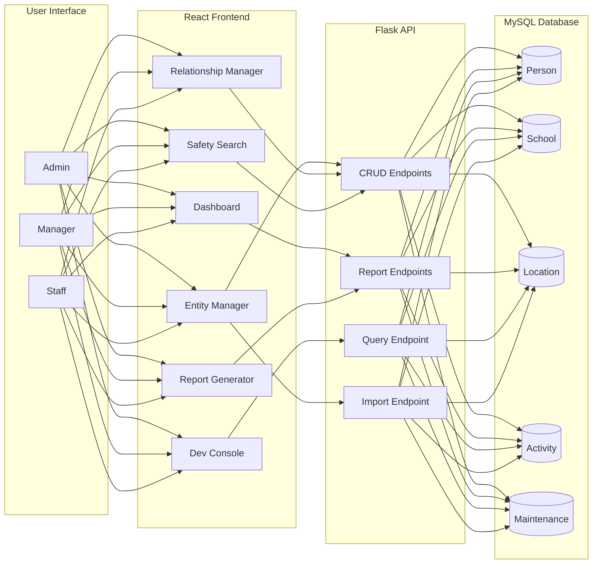
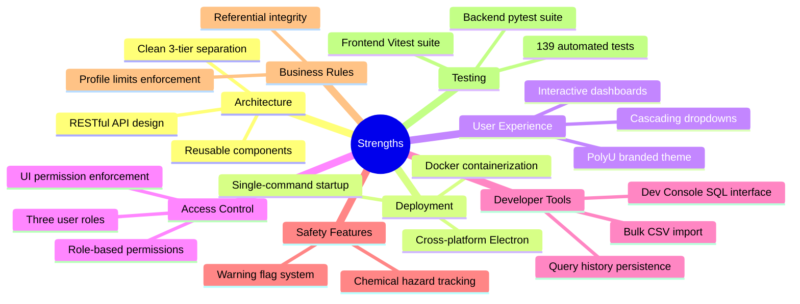
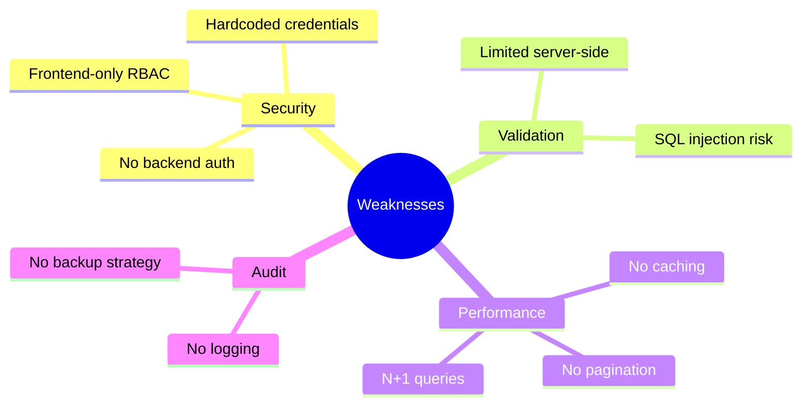

# PolyU CMMS - Comprehensive Project Report

## Campus Maintenance and Management System

**Report Generated**: November 29, 2025
**Project Repository**: `HaochenFa/COMP2411_DBMS_CMMS_GroupProject`
**Current Branch**: `haochenfa/tests`

---

## Table of Contents

1. [System Overview](#1-system-overview)
2. [System Analysis](#2-system-analysis)
3. [Strengths & Weaknesses](#3-strengths--weaknesses)
4. [Areas for Improvement](#4-areas-for-improvement)
5. [Tech Stack & Implementation Details](#5-tech-stack--implementation-details)
6. [Functionalities](#6-functionalities)
7. [Conclusion](#7-conclusion)

---

## 1. System Overview

### 1.1 Project Purpose

The **PolyU CMMS** is a database-driven Campus Maintenance and Management System designed for **The Hong Kong Polytechnic University (PolyU)**. It serves as a centralized platform to manage campus maintenance activities, personnel, facilities, schools, and events.

### 1.2 Core Objectives

- Provide real-time visibility into campus maintenance operations
- Enable efficient personnel and school affiliation management
- Track activities and events across campus locations
- Ensure safety awareness through chemical hazard tracking
- Offer data-driven insights through an executive dashboard

### 1.3 Target Users

- Campus administrators and facility managers
- Maintenance supervisors and workers
- Academic staff and department heads
- System developers (via Dev Console)

### 1.4 Development Timeline



| Phase | Date | Milestone |
|-------|------|-----------|
| Initialization | Nov 17 | Project setup, .gitignore configuration |
| Backend Setup | Nov 26 | Flask API, database schema, initial CRUD |
| UI Development | Nov 26 | React frontend, dark theme, Recharts integration |
| Docker Integration | Nov 27 | Containerization, docker-compose setup |
| Electron Wrapper | Nov 27 | Desktop application packaging |
| UI Refinement | Nov 27 | PolyU branding, red wine theme |
| Feature Addition | Nov 28 | Safety Search, Dev Console, cascading dropdowns |
| Documentation | Nov 28 | Comprehensive README update |
| Testing | Nov 29 | Comprehensive test suites (pytest, Vitest) |
| Report Generation | Nov 29 | PDF report generation with data analysis |

---

## 2. System Analysis

### 2.1 Architecture Overview


### 2.2 Database Entity-Relationship Model


### 2.3 Data Flow Diagram



---

## 3. Strengths & Weaknesses

### 3.1 Strengths ✅



| Category | Strength | Details |
|----------|----------|---------|
| **Architecture** | Clean 3-tier separation | Frontend, Backend API, Database are fully decoupled |
| **Deployment** | Docker containerization | Single-command deployment via `docker-compose` |
| **Cross-platform** | Electron desktop app | Native-like experience on Windows/macOS/Linux |
| **UX Design** | PolyU-branded theme | Professional red wine and white color scheme |
| **Access Control** | Role-based permissions | Admin, Executive, Staff roles with granular permissions |
| **Data Visualization** | Recharts integration | Interactive bar charts, pie charts for analytics |
| **Developer Tools** | Dev Console | Raw SQL execution with query history persistence |
| **Safety Features** | Chemical hazard tracking | Safety Search with warning flags for hazardous tasks |
| **Data Management** | Bulk CSV import | Efficient batch data loading capability |
| **Dynamic Forms** | Cascading dropdowns | Smart Building → Room selection with filtering |
| **Business Rules** | Profile limits | Enforced limits: 10 Mid-level Managers, 50 Base-level Workers |
| **Code Quality** | Reusable components | Generic `EntityManager` and `RelationshipManager` |
| **API Design** | RESTful endpoints | Consistent CRUD patterns across all entities |
| **Error Handling** | Comprehensive error responses | JSON error messages with MySQL error codes |
| **Data Persistence** | localStorage for Dev Console | Query history survives browser refresh |
| **PDF Reports** | ReportLab + Matplotlib | Professional PDF generation with charts |
| **Report Customization** | Selectable sections | Users choose which data to include |
| **Testing** | Comprehensive test suites | 139 automated tests across backend, frontend, desktop |
| **Test Coverage** | Multi-layer testing | Unit tests, integration tests, API tests |

### 3.2 Weaknesses ⚠️



| Category | Weakness | Impact |
|----------|----------|--------|
| **Backend Authentication** | Frontend-only role-based access control | API endpoints not protected at backend level |
| **API Security** | Dev Console allows all SQL queries | Vulnerable to data manipulation/deletion |
| **Database Security** | Hardcoded credentials in docker-compose | Security risk in production |
| **Input Validation** | Limited server-side validation | Potential for invalid data entry |
| **Pagination** | No pagination for large datasets | Performance degradation with data growth |
| **Caching** | No caching mechanism | Repeated database queries for same data |
| **Transactions** | Limited transaction management | Partial failures possible in bulk operations |
| **Audit Trail** | No audit logging | Cannot track who changed what |
| **Backup Strategy** | No documented backup procedures | Data loss risk |
| **API Rate Limiting** | No rate limiting | Vulnerable to abuse/DoS |
| **Frontend State** | No global state management | Prop drilling, potential inconsistencies |

---

## 4. Areas for Improvement

### 4.1 Priority Matrix


### 4.2 High Priority 🔴

1. **Implement Backend Authentication** ⚠️ (Partially Done)
   - ✅ Frontend role-based access control implemented (Admin, Executive, Staff)
   - ✅ UI permission enforcement for CRUD operations
   - ⏳ Add JWT-based backend authentication
   - ⏳ Protect API endpoints with role verification

2. **Secure the Dev Console**
   - ✅ Restricted to Admin role only via frontend permissions
   - ⏳ Add backend role verification
   - ⏳ Add query whitelist/blacklist
   - ⏳ Implement query auditing

3. **Environment Configuration**
   - Use environment variables for all secrets
   - Separate configs for dev/staging/production

4. **Add End-to-End Testing**
   - E2E tests for critical workflows (Playwright/Cypress)
   - Automated browser testing for UI flows

### 4.3 Medium Priority 🟡

1. **Implement Pagination**
   - Add pagination to all list endpoints
   - Frontend table pagination with page size options

2. **Add Input Validation**
   - Server-side schema validation (marshmallow/pydantic)
   - Client-side form validation with error messages

3. **Implement Audit Logging**
   - Track create/update/delete operations
   - Store user, timestamp, and changes

4. **Add Global State Management**
   - Implement Redux or Zustand for React state
   - Centralized data fetching with React Query

### 4.4 Lower Priority 🟢

1. **Performance Optimizations**
   - Add database indexing on frequently queried columns
   - Implement caching layer (Redis)
   - Optimize N+1 queries

2. **Enhanced Reporting** ✅ (Partially Implemented)
   - ~~Export reports to PDF~~ ✅ Completed
   - Custom date range filtering
   - Scheduled report generation
   - Excel export option

3. **Mobile Responsiveness**
   - Improve mobile UI for tablets/phones
   - Progressive Web App (PWA) support

---

## 5. Tech Stack & Implementation Details

### 5.1 Technology Stack


| Layer | Technology | Version/Details |
|-------|------------|-----------------|
| **Frontend** | React | Functional components with Hooks |
| **Build Tool** | Vite | Fast HMR, ESBuild bundling |
| **UI Icons** | lucide-react | Modern icon library |
| **Charts** | Recharts | React charting library |
| **HTTP Client** | Axios | Promise-based HTTP |
| **Routing** | react-router-dom | SPA navigation |
| **Backend** | Flask | Python web framework |
| **CORS** | flask-cors | Cross-origin resource sharing |
| **Database Driver** | mysql-connector-python | MySQL connectivity |
| **Environment** | python-dotenv | .env file support |
| **Database** | MySQL 8.0 | Relational database |
| **Desktop** | Electron | Cross-platform app |
| **Container** | Docker | Application containerization |
| **Orchestration** | Docker Compose | Multi-container management |

### 5.2 API Endpoint Summary

#### Entity CRUD Endpoints

| Endpoint | Methods | Description |
|----------|---------|-------------|
| `/api/persons` | GET, POST | List/create persons |
| `/api/persons/<id>` | PUT, DELETE | Update/delete person |
| `/api/profiles` | GET, POST | List/create profiles |
| `/api/schools` | GET, POST | List/create schools |
| `/api/schools/<id>` | PUT, DELETE | Update/delete school |
| `/api/locations` | GET, POST | List/create locations |
| `/api/locations/<id>` | PUT, DELETE | Update/delete location |
| `/api/activities` | GET, POST | List/create activities |
| `/api/activities/<id>` | PUT, DELETE | Update/delete activity |
| `/api/maintenance` | GET, POST | List/create maintenance tasks |
| `/api/maintenance/<id>` | PUT, DELETE | Update/delete maintenance |
| `/api/external-companies` | GET, POST | List/create companies |

#### Relationship Endpoints

| Endpoint | Methods | Description |
|----------|---------|-------------|
| `/api/participations` | GET, POST | Person-Activity links |
| `/api/affiliations` | GET, POST | Person-School links |

#### Report Endpoints

| Endpoint | Description |
|----------|-------------|
| `/api/reports/maintenance-summary` | Maintenance by location/type |
| `/api/reports/people-summary` | People by role/status |
| `/api/reports/activities-summary` | Activities by type/organizer |
| `/api/reports/school-stats` | School statistics |
| `/api/reports/maintenance-frequency` | Frequency analysis |

#### Special Endpoints

| Endpoint | Description |
|----------|-------------|
| `/api/health` | Health check |
| `/api/query` | Execute SQL (Dev Console) |
| `/api/search/safety` | Chemical hazard search |
| `/api/import` | Bulk CSV import |

#### PDF Report Endpoints

| Endpoint | Description |
|----------|-------------|
| `/api/reports/comprehensive-data` | Get all report data (JSON) |
| `/api/reports/generate-pdf` | Generate comprehensive PDF report |

### 5.3 Frontend Component Architecture


### 5.4 Database Schema Highlights

**Key Design Decisions:**

| Decision | Implementation | Rationale |
|----------|----------------|-----------|
| **Dynamic Age Calculation** | `TIMESTAMPDIFF(YEAR, date_of_birth, CURDATE())` | Avoids stale data, always current |
| **Building Denormalization** | VARCHAR attribute in Location | Simplified schema, reduced joins |
| **Profile Limits** | API-level enforcement | 10 Mid-level Managers, 50 Base-level Workers |
| **Chemical Tracking** | Boolean `active_chemical` flag | Simple safety search implementation |
| **Self-referencing FK** | `supervisor_id` → `personal_id` | Hierarchical supervisor relationships |

---

## 6. Functionalities

### 6.1 Feature Overview

```mermaid
flowchart LR
    subgraph Core["Core Features"]
        D[📊 Dashboard]
        CRUD[📝 Entity CRUD]
        REL[🔗 Relationships]
    end

    subgraph Access["Access Control"]
        RBAC[🔐 Role-Based Access]
        PERM[👤 User Permissions]
    end

    subgraph Safety["Safety Features"]
        SS[⚠️ Safety Search]
        CH[🧪 Chemical Tracking]
    end

    subgraph DevTools["Developer Tools"]
        DC[💻 Dev Console]
        IMP[📥 CSV Import]
    end

    subgraph Reports["Analytics & Export"]
        MS[Maintenance Summary]
        PS[People Summary]
        AS[Activity Summary]
        SchS[School Stats]
        PDF[📄 PDF Reports]
    end

    RBAC --> D & CRUD & REL & DC
    D --> MS & PS & AS & SchS
    PDF --> MS & PS & AS & SchS
```



### 6.2 Role-Based Access Control

**Purpose**: Control user access to features based on their role

```mermaid
flowchart TB
    subgraph Roles["User Roles"]
        Admin[🔑 Admin<br/>Full Access]
        Exec[📊 Executive<br/>View + Reports]
        Staff[👷 Staff<br/>Limited Access]
    end

    subgraph Permissions["Permission Matrix"]
        P1[canViewDashboard]
        P2[canViewReports]
        P3[canViewSafetySearch]
        P4[canViewDevConsole]
        P5[canCreate]
        P6[canUpdate]
        P7[canDelete]
        P8[canViewEntities]
    end

    Admin --> P1 & P2 & P3 & P4 & P5 & P6 & P7 & P8
    Exec --> P1 & P2 & P3 & P8
    Staff --> P3 & P8
```



**Role Permissions**:

| Permission | Admin | Executive | Staff |
|------------|-------|-----------|-------|
| View Dashboard | ✅ | ✅ | ❌ |
| View Reports | ✅ | ✅ | ❌ |
| View Safety Search | ✅ | ✅ | ✅ |
| View Dev Console | ✅ | ❌ | ❌ |
| View Building Supervision | ✅ | ✅ | ❌ |
| Create Records | ✅ | ❌ | ❌ |
| Update Records | ✅ | ❌ | ❌ |
| Delete Records | ✅ | ❌ | ❌ |
| View Entities | ✅ | ✅ | ✅ |

**Implementation**:

- `RoleContext.jsx` - React Context for role state management
- `useRole()` hook - Access role and permissions in components
- `hasPermission()` - Check specific permission for current user
- UI components conditionally render based on permissions
- Login page for role selection with localStorage persistence

### 6.3 Executive Dashboard

**Purpose**: Provide real-time insights into campus management metrics

**Visualizations**:

- **Maintenance by Location**: Bar chart showing task distribution across buildings
- **People by Role**: Pie chart visualizing personnel distribution
- **Activities by Type**: Horizontal bar chart of activity counts
- **School Statistics**: Grouped bar chart (people + locations per school)
- **Maintenance Frequency**: Table view (Daily, Weekly, Monthly)

### 6.4 Entity Management

**Supported Entities & Fields**:

| Entity | Key Fields |
|--------|------------|
| **People** | Personal ID, Name, Gender, DOB, Entry Date, Supervisor |
| **Schools** | Name, Department, Faculty, HQ Building |
| **Activities** | ID, Type, Time, Organizer, Location |
| **Maintenance** | Type, Frequency, Location, Chemical Usage, Contractor |

**CRUD Features**:

- ✅ Create new records with form validation (Admin only)
- ✅ Edit existing records inline (Admin only)
- ✅ Delete with confirmation dialog (Admin only)
- ✅ Dynamic dropdown options from related tables
- ✅ Cascading selects (Building → Room)
- ✅ CSV bulk import (Admin only)
- ✅ Role-based UI - buttons hidden for non-Admin users

### 6.5 Relationship Management


### 6.6 Safety Search

**Purpose**: Identify cleaning activities that may use hazardous chemicals

**Features**:

- Building-based search filter
- Displays cleaning maintenance tasks
- **Warning Flags**: Red alert with ⚠️ icon for `active_chemical = true`
- Shows location details (building, room, floor) and frequency

### 6.7 PDF Report Generation

**Purpose**: Generate professional PDF reports with comprehensive data analysis

**Features**:

- **Section Selection**: Choose which sections to include in the report
  - Executive Summary (KPI metrics and overview)
  - Maintenance Analysis (tasks by location/type with charts)
  - Personnel Overview (staff by role and status)
  - Activities Statistics (events summary with organizers)
  - Department Statistics (school/faculty data)
  - Safety Report (chemical hazard analysis)
- **PolyU Branding**: Professional styling with university colors (#A6192E, #B08E55)
- **Data Visualization**: Bar charts and pie charts embedded in PDF
- **Automatic Download**: One-click PDF generation and download

**Technical Implementation**:

- Backend: ReportLab for PDF generation, Matplotlib for charts
- Frontend: React component with section checkboxes
- API: `/api/reports/generate-pdf` returns PDF binary

### 6.8 Developer Console

**Purpose**: Direct database access for debugging and advanced queries

**Access**: Admin role only (hidden from Executive and Staff users)

**Features**:

- SQL query editor with monospace font
- Execute any SQL query (SELECT, INSERT, UPDATE, DELETE)
- Query result table with scrollable display
- **Query History**: Last 10 queries with success/fail status
- **LocalStorage Persistence**: Survives page refresh
- Error display with MySQL error messages
- **Danger Zone Warning**: Alerts users to potential data risks

### 6.9 Business Rule Enforcement


### 6.10 Automated Testing

**Purpose**: Ensure code quality and prevent regressions through comprehensive test suites


**Test Coverage**:

| Component | Framework | Tests | Coverage |
|-----------|-----------|-------|----------|
| Backend | pytest + pytest-cov | 96 | API endpoints, DB utilities |
| Frontend | Vitest + React Testing Library | 39 | Components, API integration |
| Desktop | Vitest | 4 | Electron utilities |
| **Total** | - | **139** | - |

**Backend Test Categories**:

- `test_api_persons.py` - Person CRUD operations
- `test_api_schools.py` - School CRUD operations
- `test_api_locations.py` - Location CRUD operations
- `test_api_activities.py` - Activity CRUD operations
- `test_api_maintenance.py` - Maintenance CRUD operations
- `test_api_profiles.py` - Profile CRUD with business rule validation
- `test_api_relationships.py` - Participation/Affiliation operations
- `test_api_reports.py` - Dashboard report endpoints
- `test_api_special.py` - Safety search and raw query endpoints
- `test_db.py` - Database connection utilities
- `integration/` - Full database integration tests

**Frontend Test Categories**:

- `Dashboard.test.jsx` - Dashboard rendering and chart display
- `DevConsole.test.jsx` - SQL console functionality
- `EntityManager.test.jsx` - Generic CRUD component
- `RelationshipManager.test.jsx` - Relationship management
- `SafetySearch.test.jsx` - Chemical hazard search
- `api.test.jsx` - Frontend-backend API integration

---

## 7. Conclusion

The **PolyU CMMS** is a well-structured, functional Campus Maintenance and Management System that successfully demonstrates a modern full-stack architecture with comprehensive testing.

### Key Achievements ✅

- **Solid technical foundations** with React, Flask, and MySQL
- **Clean separation of concerns** across frontend, backend, and database layers
- **User-friendly features** including dashboards, CRUD operations, and safety search
- **Professional PDF report generation** with PolyU branding and data visualization
- **Developer productivity tools** like the Dev Console and bulk import
- **Comprehensive test suites** with 139 automated tests covering all layers:
  - Backend: 96 pytest tests (unit + integration)
  - Frontend: 39 Vitest tests (components + API integration)
  - Desktop: 4 Vitest tests (Electron utilities)
- **Quality assurance infrastructure** with pytest-cov for coverage and mocked database connections

### Priority Improvements 🎯

1. **Security**: Authentication, input validation, secure Dev Console
2. **End-to-End Testing**: Browser automation with Playwright/Cypress
3. **Performance**: Pagination, caching, query optimization

### Test Execution Summary

```bash
# Backend: 96 tests (85 passed, 11 skipped - integration tests require DB)
cd backend && pytest tests/ -v

# Frontend: 39 tests passed
cd frontend && npm test -- --run

# Desktop: 4 tests passed
cd desktop && npm test -- --run
```

---

> Report prepared for COMP2411 Database Systems Group Project
